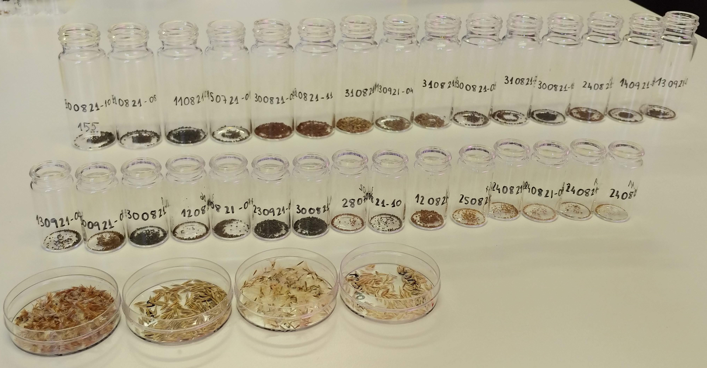

Read me: Article summary.md
================

# Functional trade-offs and ecological correlates of seed oil traits in alpine ecosystems

This repository stores all the information related to the manuscript
[*Functional trade-offs and ecological correlates of seed oil traits in
alpine ecosystems*](http://doi.org/10.1111/plb.70097), including the raw
datasets, the scripts to perform data cleaning, analysis and figures.

<figure>

<figcaption aria-hidden="true">Seeds prepared for longevity
analysis</figcaption>
</figure>

<figure>

<figcaption aria-hidden="true">Seeds prepared for oil
analysis</figcaption>
</figure>

## Contents

This repository is organised following the advice of [Wilson et
al. 2017](https://doi.org/10.1371/journal.pcbi.1005510) for recording
and storing research projects.

The following materials are available in the folders of this repository:

- `data` Data files including the [Oil data of alpine
  species](https://github.com/clara-espinosa/Oilcontent_Longevity/blob/main/data/oil_alpinedata.csv),
  [Oil data of regional
  species](https://github.com/clara-espinosa/Oilcontent_Longevity/blob/main/data/oil_regionaldata.csv),
  [Species taxonomy and
  ecology](https://github.com/clara-espinosa/Oilcontent_Longevity/blob/main/data/species_header.csv),
  [Oil types
  classification](https://github.com/clara-espinosa/Oilcontent_Longevity/blob/main/data/FA_types.csv)
  and [Trait Summary table for studied alpine
  species](https://github.com/clara-espinosa/Oilcontent_Longevity/blob/main/data/species_traits.csv)

- `doc` Manuscript submitted to Plant Biology.

- `results` Output of the `R` scripts, including figures, tables,
  phylogeny and supplementary information.

- `src` Scripts in `R` language used to clean the raw data, perform the
  analyses of the manuscript and create the figures.

## Abstract

- **Background** Seed oil content is a crucial energy reserve in
  angiosperms, with effects on biological functions and plant fitness,
  playing an important role in seed protection from environmental
  conditions. However, the eco‐evolutionary role of seed oil traits in
  natural ecosystems is largely unexplored.

- **Methods** We studied functional trade‐offs and ecological drivers of
  seed oil traits in 47 species of an alpine flora. We analysed seed oil
  content and composition – relative proportion of unsaturated and
  saturated fatty acids (UFA/SFA) – and their relationships with seed
  mass, seed longevity, and germination timing. We also tested the
  response of seed oil traits to species’ ecological preferences along
  microclimatic gradients.

- **Key Results** Seed oil content ranged from 1% to 34.2%, with the
  main variation explained by the UFA/SFA ratio, and little variation
  across altitude.Seed oil content significantly influenced seed
  longevity but had no relationships to seed mass and germination.
  Contrary to expectations, microclimatic gradients did not affect seed
  oil content or composition. All analyses showed strong phylogenetic
  constraints on seed oil traits.

- **Conclusion** Seed oil traits in alpine species do not differ from
  those of other herbaceous species. A major trade‐off between seed oil
  and seed longevity may help in understanding species regeneration in
  alpine soils and defining protocols for ex‐situ conservation. The
  evolutionary conservatism of seed oil traits likely prevents selective
  responses of alpine species across altitudinal and microclimatic
  gradients.

## Citation

Please cite the repository, datasets and article as: Espinosa del Alba,
C., Mondoni, A., Baizán, S., Fernández-Pascual, E. and Jiménez-Alfaro,
B.(2025). Functional trade-offs and ecological correlates of seed oil
traits in alpine ecosystems. Plant Biology. DOI:
<http://doi.org/10.1111/plb.70097>.
